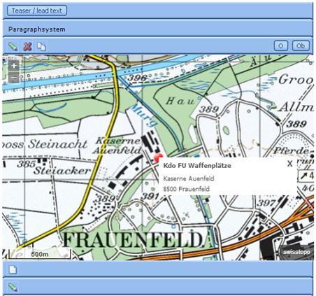
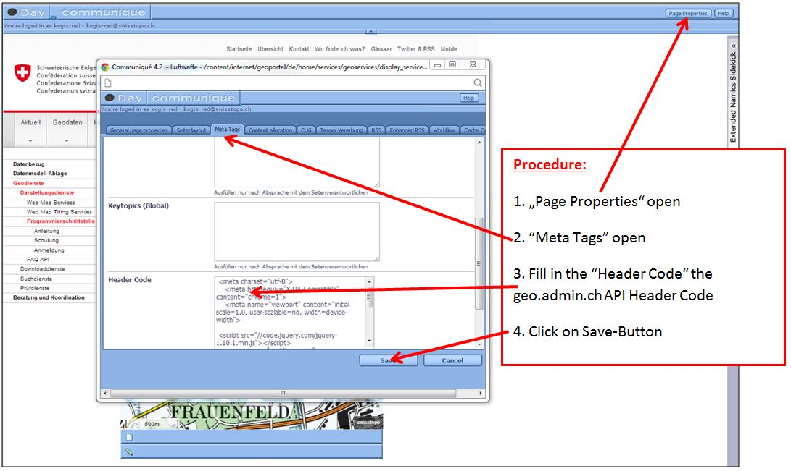
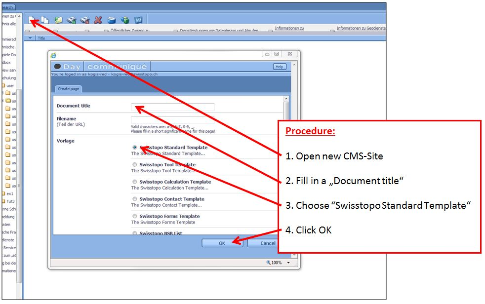
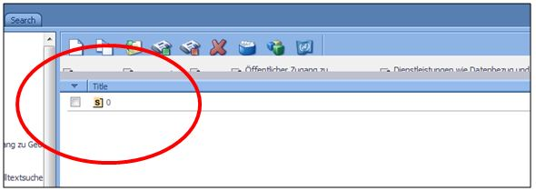
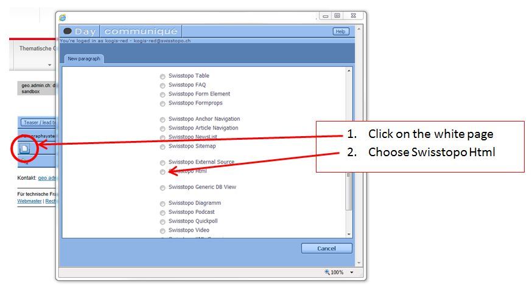
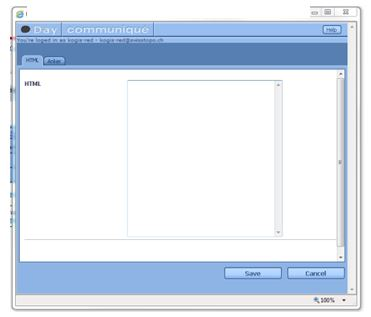
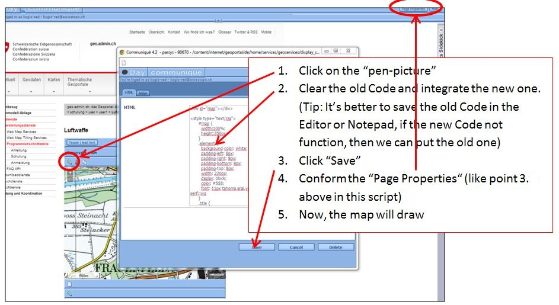

.. raw:: html

  <head>
    <link href="../_static/custom.css" rel="stylesheet" type="text/css" />
  </head>

API Integrate CMS 
=================

Result:
-------

Procedure:
----------
#. Open the web page you want to modify using the CMS.(Example insted of: http://cmsr.*.admin.ch)
#. Enter you keyword and username 
#. We can modify the map as follows:(Tip: It'better to save our old code in a text editor of your choice in case the new code doesn't work)

Modify the map 
--------------

- About this example (Standortmarkierung mit Info-Box) we fill in the „Header Code“ the Code as follows: 

.. code-block:: html

 <meta charset="utf-8">
 <meta http-equiv="X-UA-Compatible" content="chrome=1">
 <meta name="viewport" content="initial-scale=1.0, user-scalable=no, width=device-width">
 
 

- At this point the map doesn't exist yet. We must fill in the Javascript-Part. To do so, we have two possibilities: 
#. First possibility: Generate a new paragraph 
#. Open the side like: http://cmsr.*.admin.ch
#. Possibly: Fill in the keyword and the username
#. Show the picture below: 

   
4.1 Open the generated file 

4.2 The window is generated as follows 

4.3 This window appears (see below). Insert the HTML code (Javascript) and save it. Now, we can’t see the map, we must do the point 3.1 (show above) in this script. 

5. Second possibility: We have already a map put in the old API generated. Now, we try this follows steps: 

5.1 The Code in our example (Waffenplatz Frauenfeld) is: 

.. code-block:: html

 

 
 <!--load api3 and set language-->
 

6. Is everything alright? Publish the new map in production.  

